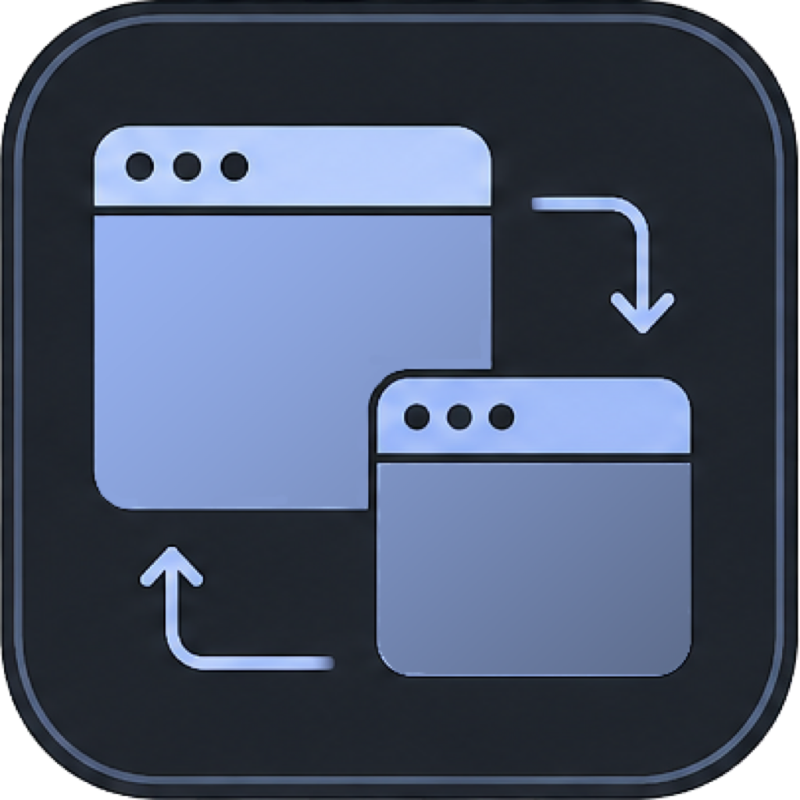
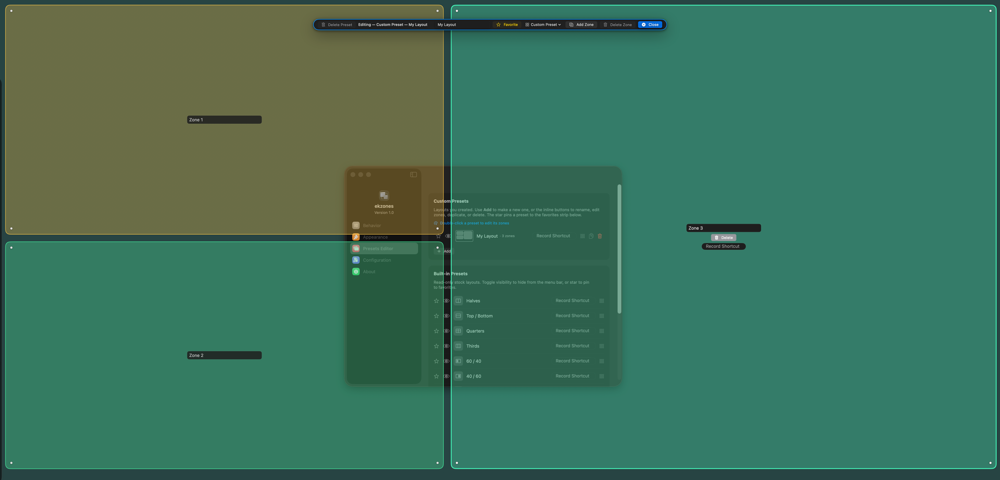
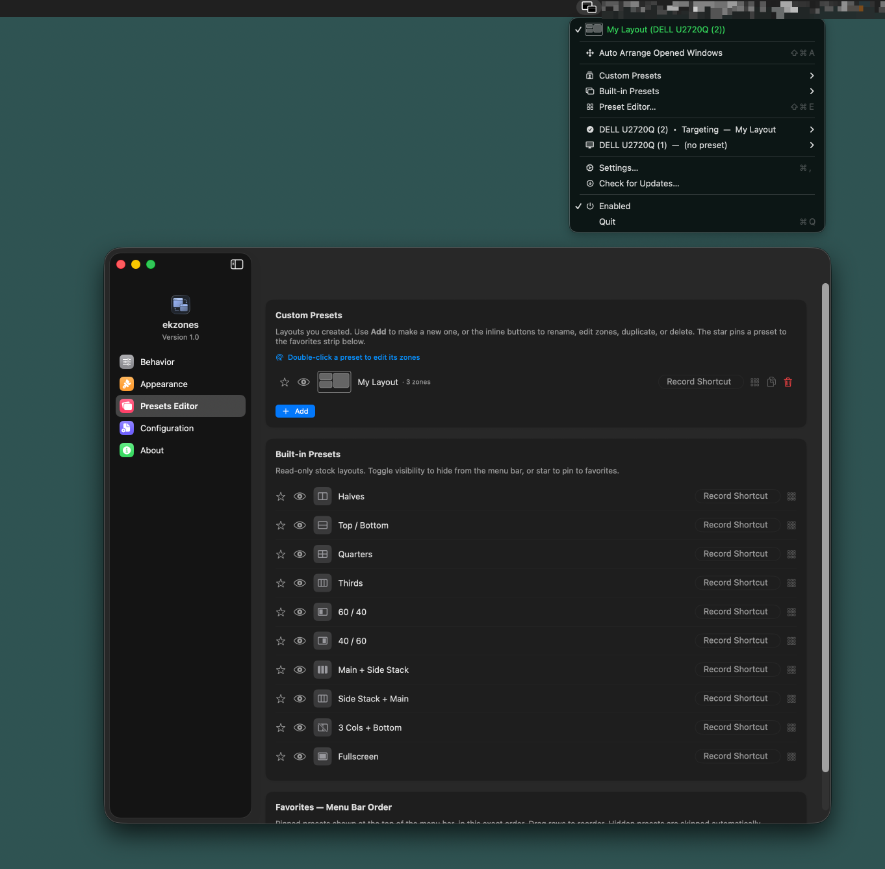
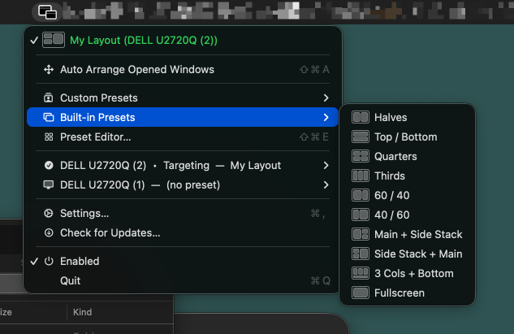

<div align="center">



# ekzones

### A snappy, **free** window manager for macOS

Hold **Shift**, drag any window, and drop it into a zone.
Custom layouts, global hotkeys, multi‑monitor — no subscriptions, no account, no nonsense.

<br/>

 

<br/>

<a href="https://github.com/enizvk/ekzones/releases/latest">
  
</a>

[Releases](https://github.com/enizvk/ekzones/releases)
<br/><br/>



</div>

---

## ✨ Why ekzones

Tiling and snapping tools on the Mac are either fiddly, paid, or do too much. **ekzones** does one thing well: you draw the zones you want, then snap windows into them by **Shift‑dragging**. It lives quietly in your menu bar and gets out of the way.

- 🆓 **Completely free** — no trial, no in‑app purchase, no account.
- 🪶 **Lightweight** — a single menu‑bar app, statically linked, tiny footprint.
- 🔌 **Works everywhere** — any app's windows, across all your displays.

## 🚀 Features

| | |
|---|---|
| 🧲 **Shift‑drag to snap** | Grab a window, hold your modifier, and drop it into a glowing zone. The modifier is configurable (Shift, ⌘, ⌥…). |
| 🎨 **Custom zones** | Draw your own per‑monitor layouts in the visual editor — any size, any arrangement. |
| 📐 **Built‑in presets** | Halves, Thirds, Quarters, Fullscreen, Top/Bottom, 40/60, 60/40, Main + Side Stack, 3 Cols + Bottom, and more. |
| ⌨️ **Global hotkeys** | Bind a shortcut to any zone or preset and snap the focused window instantly. |
| 🖥️ **Multi‑display** | Independent zones per monitor, with a per‑display on/off switch. |
| 🪟 **Per‑Space layouts** | Optionally keep different layouts on different macOS Spaces. |
| ✨ **Auto‑arrange** | Apply a preset and let ekzones lay out your open windows for you. |
| 💾 **Import / export** | Save your whole setup to a `.ekzones` file and sync it between Macs. |
| 🌓 **Looks native** | System / Light / Dark appearance, start‑at‑login, optional menu‑bar hiding. |
| ⬆️ **Auto‑updates** | New versions install themselves, securely — see below. |

## 📸 Screenshots

> _Placeholder graphics below — swap them for real captures (see `docs/screenshots/`)._

<div align="center">


</div>

## ⬇️ Install

1. **[Download the latest `.dmg`](https://github.com/enizvk/ekzones/releases/latest)**.
2. Open it and **right‑click → Open** on `Install ekzones.command` (or drag the app to **Applications**).
3. On first launch, grant **Accessibility**: System Settings → Privacy & Security → Accessibility → enable **ekzones**.

> **"ekzones can't be opened because it's from an unidentified developer."**
> That's expected — ekzones is free and not notarized by Apple. The bundled **Install** command clears the flag for you. If you install manually, run once in Terminal:
> ```sh
> xattr -dr com.apple.quarantine /Applications/ekzones.app
> ```

**Requirements:** macOS 14 (Sonoma) or later · Apple Silicon or Intel.

## ⚡ Quick start

- **Snap a window:** hold **Shift** and drag a window's title bar — zones light up; drop it on one.
- **Apply a preset:** click the menu‑bar icon → pick a preset (e.g. *Halves*). Turn on **Auto‑arrange** to move open windows too.
- **Use a shortcut:** open **Settings → Presets**, record a hotkey for a zone or preset, then press it to snap the focused window.
- **Customize:** **Settings → Presets Editor** to draw your own zones; **Behavior** to change the drag modifier.

## ⬆️ Automatic updates

ekzones updates itself via [Sparkle](https://sparkle-project.org). Every update is verified with a cryptographic (EdDSA) signature before it's installed. You can also check anytime from the menu bar or **Settings → About → Check for Updates…**

## ❓ FAQ

<details>
<summary><b>Is it really free?</b></summary>
Yes — free to download and use, with no account, ads, or paid tiers.
</details>

<details>
<summary><b>Why does macOS warn me on first launch?</b></summary>
The app isn't notarized by Apple. It's safe to open — use the bundled Install command or the <code>xattr</code> step above.
</details>

<details>
<summary><b>Why does it need Accessibility permission?</b></summary>
Moving and resizing other apps' windows, and detecting your Shift‑drag, both require macOS Accessibility access. ekzones doesn't read your screen or keystrokes for anything else.
</details>

<details>
<summary><b>Will my zones survive updates?</b></summary>
Yes. Your layouts live in <code>~/Library/Application Support/ekzones/</code>, and updates preserve both your config and your Accessibility grant.
</details>

## 📝 License
[Apache License 2.0](https://www.apache.org/licenses/LICENSE-2.0)

**Free to download and use.**

 © 2026 Eniz Karadzha. All rights reserved.


<div align="center">
<br/>


Made with ❤️ for people who like tidy desktops.
</div>
